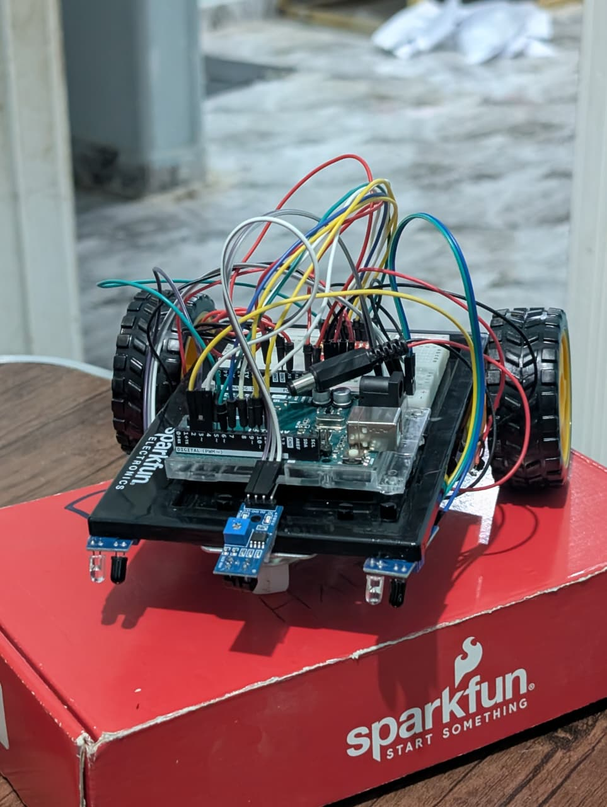
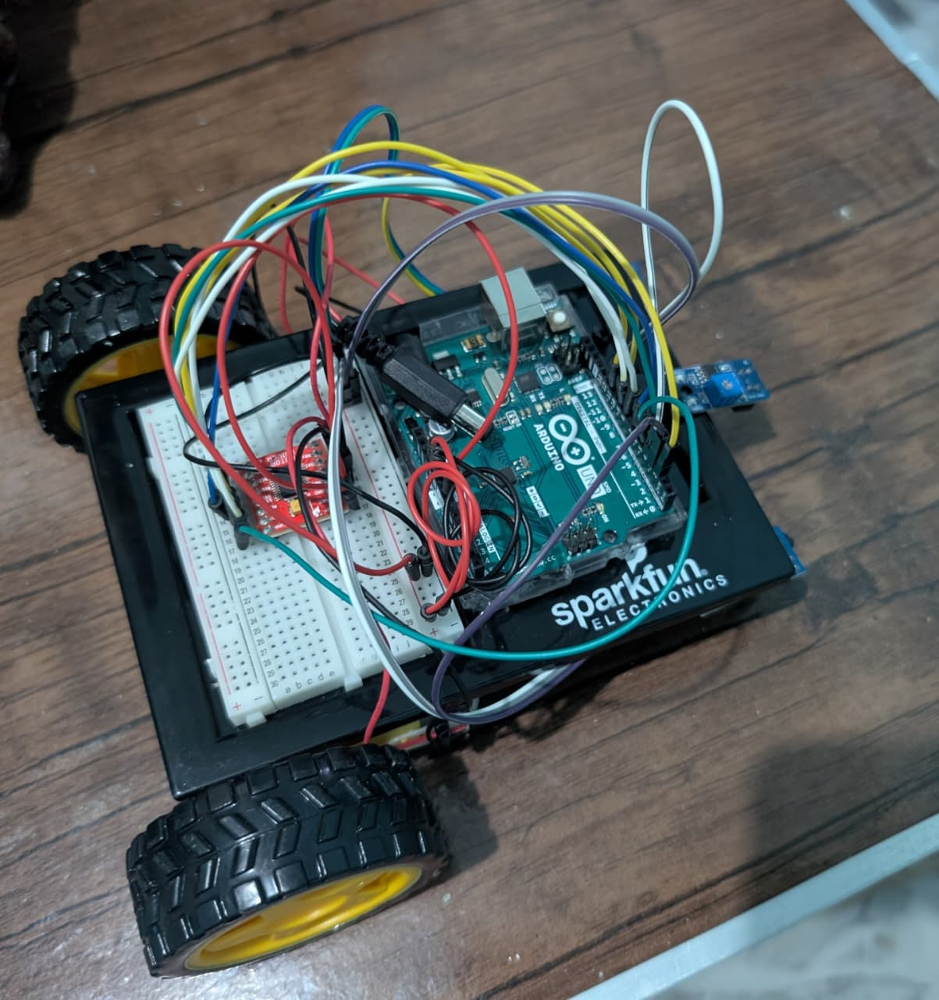
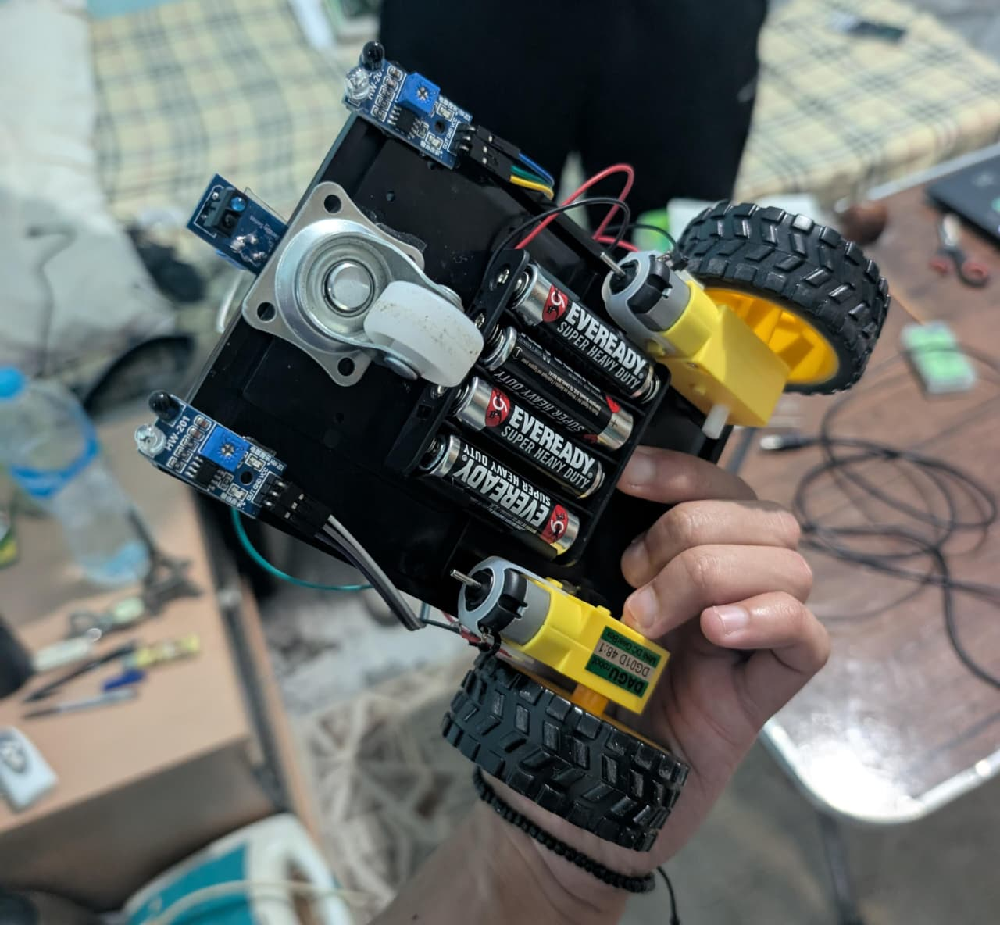

# 🤖 Line Follower Robot

An Arduino-based autonomous line-following robot with a smart sensor brain and a multi-step recovery system. Built on a two-wheel differential drive chassis using a TB6612FNG motor driver and three digital IR sensors.

<p align="center">
  
</p>

---

## 📸 Gallery

<p align="center">
  
  &nbsp;&nbsp;
  
</p>
<p align="center"><em>Left: top view showing Arduino & wiring &nbsp;|&nbsp; Right: underside with IR sensors</em></p>

---

## 🎥 Demo Video

> **[▶ Watch the robot in action](./Video_of_Running.mp4)**
>
> *(Download or clone the repo to play the video locally — GitHub does not stream `.mp4` files inline)*

---

## 📖 Overview

This robot detects and follows a dark line on a light surface using three IR sensors (left, middle, right). When the line is lost, it enters an intelligent recovery routine that systematically searches for the line before giving up.

---

## 🧰 Hardware

| Component | Details |
|---|---|
| Microcontroller | Arduino (SparkFun variant) |
| Motor Driver | TB6612FNG dual H-bridge |
| Sensors | 3× digital IR line sensors |
| Drive | 2× DC motors with rubber wheels |
| Chassis | Custom black acrylic two-wheel platform |

### Pin Mapping

| Pin | Role |
|---|---|
| D2 | Left IR sensor |
| D3 | Right IR sensor |
| D4 | Middle IR sensor |
| D5 | PWMA — Motor A speed |
| D6 | PWMB — Motor B speed |
| D7 | STBY — Motor driver enable |
| D8 | AIN1 — Motor A direction |
| D9 | AIN2 — Motor A direction |
| D10 | BIN1 — Motor B direction |
| D11 | BIN2 — Motor B direction |

---

## 🧠 How It Works

### Sensor Logic (Brain)

All three sensors are read simultaneously each loop cycle, and their combined state drives a smarter decision than reading each sensor in isolation.

| Sensor State (L / M / R) | Action |
|---|---|
| 1 / 1 / 1 | Forward (intersection) |
| 1 / 1 / 0 | Soft left (drifting right) |
| 0 / 1 / 1 | Soft right (drifting left) |
| 0 / 1 / 0 | Forward (perfectly centered) |
| 1 / 0 / 0 | Hard left turn |
| 0 / 0 / 1 | Hard right turn |
| 1 / 0 / 1 | Forward (ambiguous split — hold course) |
| 0 / 0 / 0 | **Enter recovery mode** |

### Recovery State Machine

When all sensors lose the line, the robot runs through a timed recovery sequence without blocking the main sensor loop:

```
Step 0 → Back up (300ms)         — in case the line was overshot
Step 1 → Spin toward last known side (400ms)  — most likely direction
Step 2 → Sweep the opposite side (700ms)      — wider arc
Step 3 → Creep forward slowly (500ms)         — line might be further ahead
Step 4 → Full 180° spin (1000ms)              — last resort, then loop back to Step 1
```

The robot remembers the last direction it tracked (`lastDirection`) so recovery starts on the most probable side first.

---

## ⚙️ Motion Functions

| Function | Behavior |
|---|---|
| `forward()` | Both motors full speed ahead |
| `backward()` | Both motors full speed reverse |
| `creep()` | Both motors at ~44% speed (PWM 80) |
| `softLeft()` | Right motor drives, left motor off |
| `softRight()` | Left motor drives, right motor off |
| `turnLeft()` | Right motor drives, left motor off (hard) |
| `turnRight()` | Left motor drives, right motor off (hard) |
| `spinLeft()` | Motors in opposite directions — pivot left |
| `spinRight()` | Motors in opposite directions — pivot right |
| `stopMotors()` | Cut power to both motors |

---

## 🚀 Getting Started

### Prerequisites

- [Arduino IDE](https://www.arduino.cc/en/software) (or Arduino CLI)
- No external libraries required — uses only built-in Arduino functions

### Upload

1. Clone this repository:
   ```bash
   git clone https://github.com/your-username/line-follower-robot.git
   ```
2. Open `Code_of_line_follower.ino` in the Arduino IDE.
3. Select your board and COM port.
4. Click **Upload**.

### Calibration

Motor speeds are pre-calibrated at `speedA = 180` and `speedB = 180`. If the robot pulls to one side, adjust these values individually to compensate for motor variation.

---

## 🐛 Debugging

Open the **Serial Monitor** at **9600 baud** to watch live sensor readings in the format:

```
LEFT  MIDDLE  RIGHT
1     1       0      → soft left correction
0     1       0      → forward (centered)
0     0       0      → recovery triggered
```

Recovery steps are also printed to Serial so you can follow exactly which step is executing.

---

## 📁 Project Structure

```
Line_Follower_Car/
├── Code_of_line_follower.ino   # Main Arduino sketch
├── Car_pic.jpeg                # Hero photo
├── Upper_car.jpeg              # Top view photo
├── down_car.jpeg               # Underside / sensor view photo
├── Video_of_Running.mp4        # Demo video
└── README.md
```

---

## 🔧 Tuning Tips

- **Speeds too fast on curves?** Lower `speedA` and `speedB` (try 130–150).
- **Recovery spinning past the line?** Reduce the duration in `recoveryStep 1` or `2`.
- **Sensor reads inverted?** Your IR modules may output `LOW` on the line — flip the logic in `brain()`.
- **Wobbly on straight sections?** Verify both motors spin at equal speed; adjust PWM values to compensate.

---

## 📄 License

MIT License — free to use, modify, and share.
